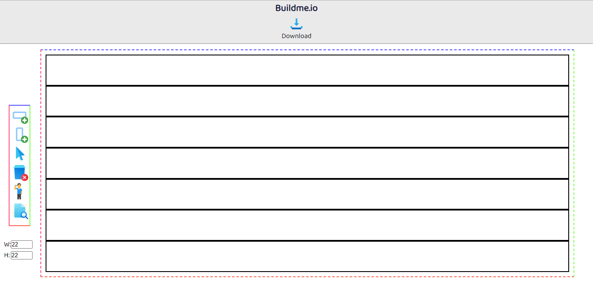

# Buildme.io (Best CSS grid generator!)

Buildme.io will help you to design very simple webpage on browser and give you the HTML and CSS code of respective design. 

## Where is Buildme.io ? 
 Will be available soon!

## Buildme.io Building Process!

#### 10% (simple design) 

#### 20% (added some JavaScript)

#### 30% (Three Buttons will work now- Add div, Add Row, Add Column)

#### 40% (Dark Theme, delete button)

#### 50% (Now you can select div inside design area)

#### 60% (Now you can view your design)

#### 80% (now you can change size of rows and column in Buidme.io)

#### 90% (making custom popup for grid-start and grid-end)

